# [📈 Live Status](https://myqua.github.io/LOUIS-upptime): <!--live status--> **🟨 Degraded performance**

This repository contains the open-source uptime monitor and status page for LOUIS web applications, powered by [Upptime](https://github.com/upptime/upptime).

<!--start: status pages-->
<!-- This summary is generated by Upptime (https://github.com/upptime/upptime) -->
<!-- Do not edit this manually, your changes will be overwritten -->
<!-- prettier-ignore -->
| URL | Status | History | Response Time | Uptime |
| --- | ------ | ------- | ------------- | ------ |
|  [BRCC Enterprise](https://brcc.ent.sirsi.net/client/en_US/brcc/search/results?te=) | 🟩 Up | [brcc-enterprise.yml](https://github.com/myqua/LOUIS-upptime/commits/HEAD/history/brcc-enterprise.yml) | 

 2897ms
     
 | 

<a href="https://myqua.github.io/LOUIS-upptime/history/brcc-enterprise">97.28%</a>
    

|  [BPCC Enterprise](https://bpcc.ent.sirsi.net/client/en_US/bpcc/search/results?te=) | 🟩 Up | [bpcc-enterprise.yml](https://github.com/myqua/LOUIS-upptime/commits/HEAD/history/bpcc-enterprise.yml) | 

 898ms
     
 | 

<a href="https://myqua.github.io/LOUIS-upptime/history/bpcc-enterprise">97.28%</a>
    

|  [Delta Enterprise](https://delta.ent.sirsi.net/client/en_US/delta/search/results?te=) | 🟩 Up | [delta-enterprise.yml](https://github.com/myqua/LOUIS-upptime/commits/HEAD/history/delta-enterprise.yml) | 

 1610ms
     
 | 

<a href="https://myqua.github.io/LOUIS-upptime/history/delta-enterprise">97.28%</a>
    

|  [Fletcher Enterprise](https://fletcher.ent.sirsi.net/client/en_US/fletcher/search/results?te=) | 🟩 Up | [fletcher-enterprise.yml](https://github.com/myqua/LOUIS-upptime/commits/HEAD/history/fletcher-enterprise.yml) | 

 3290ms
     
 | 

<a href="https://myqua.github.io/LOUIS-upptime/history/fletcher-enterprise">97.28%</a>
    

|  [Grambling Enterprise](https://grambling.ent.sirsi.net/client/en_US/grambling/search/results?te=) | 🟩 Up | [grambling-enterprise.yml](https://github.com/myqua/LOUIS-upptime/commits/HEAD/history/grambling-enterprise.yml) | 

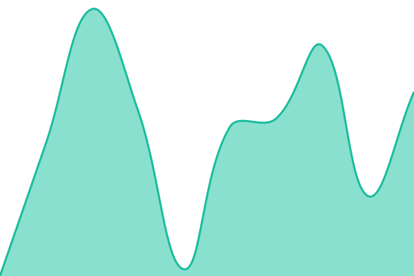 3264ms
     
 | 

<a href="https://myqua.github.io/LOUIS-upptime/history/grambling-enterprise">97.29%</a>
    

|  [LSU Enterprise](https://lsu.ent.sirsi.net/client/en_US/lsu/search/results?te=) | 🟩 Up | [lsu-enterprise.yml](https://github.com/myqua/LOUIS-upptime/commits/HEAD/history/lsu-enterprise.yml) | 

 4288ms
     
 | 

<a href="https://myqua.github.io/LOUIS-upptime/history/lsu-enterprise">97.29%</a>
    

|  [LSU-A Enterprise](https://lsua.ent.sirsi.net/client/en_US/lsua/search/results?te=) | 🟩 Up | [lsu-a-enterprise.yml](https://github.com/myqua/LOUIS-upptime/commits/HEAD/history/lsu-a-enterprise.yml) | 

 945ms
     
 | 

<a href="https://myqua.github.io/LOUIS-upptime/history/lsu-a-enterprise">97.29%</a>
    

|  [LSUCES Enterprise](https://lsuces.ent.sirsi.net/client/en_US/lsuces/search/results?te=) | 🟩 Up | [lsuces-enterprise.yml](https://github.com/myqua/LOUIS-upptime/commits/HEAD/history/lsuces-enterprise.yml) | 

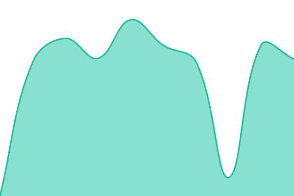 819ms
     
 | 

<a href="https://myqua.github.io/LOUIS-upptime/history/lsuces-enterprise">97.29%</a>
    

|  [LSU-E Enterprise](https://lsue.ent.sirsi.net/client/en_US/lsue/search/results?te=) | 🟩 Up | [lsu-e-enterprise.yml](https://github.com/myqua/LOUIS-upptime/commits/HEAD/history/lsu-e-enterprise.yml) | 

 1126ms
     
 | 

<a href="https://myqua.github.io/LOUIS-upptime/history/lsu-e-enterprise">97.29%</a>
    

|  [LSU Law Enterprise](https://lsulaw.ent.sirsi.net/client/en_US/lsulaw/search/results?te=) | 🟩 Up | [lsu-law-enterprise.yml](https://github.com/myqua/LOUIS-upptime/commits/HEAD/history/lsu-law-enterprise.yml) | 

 1336ms
     
 | 

<a href="https://myqua.github.io/LOUIS-upptime/history/lsu-law-enterprise">97.29%</a>
    

|  [LSU-S Enterprise](https://lsus.ent.sirsi.net/client/en_US/lsus/search/results?te=) | 🟩 Up | [lsu-s-enterprise.yml](https://github.com/myqua/LOUIS-upptime/commits/HEAD/history/lsu-s-enterprise.yml) | 

 1198ms
     
 | 

<a href="https://myqua.github.io/LOUIS-upptime/history/lsu-s-enterprise">97.30%</a>
    

|  [McNeese Enterprise](https://mcneese.ent.sirsi.net/client/en_US/mcneese/search/results?te=) | 🟩 Up | [mc-neese-enterprise.yml](https://github.com/myqua/LOUIS-upptime/commits/HEAD/history/mc-neese-enterprise.yml) | 

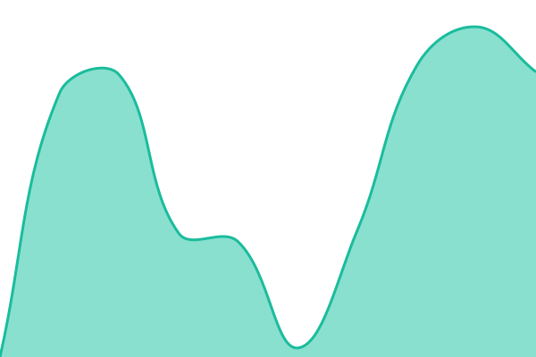 3092ms
     
 | 

<a href="https://myqua.github.io/LOUIS-upptime/history/mc-neese-enterprise">97.30%</a>
    

|  [Centenary Enterprise](https://centenary.ent.sirsi.net/client/en_US/centenary/search/results?te=) | 🟩 Up | [centenary-enterprise.yml](https://github.com/myqua/LOUIS-upptime/commits/HEAD/history/centenary-enterprise.yml) | 

 1364ms
     
 | 

<a href="https://myqua.github.io/LOUIS-upptime/history/centenary-enterprise">97.30%</a>
    

|  [LaTech Enterprise](https://latech.ent.sirsi.net/client/en_US/latech/search/results?te=) | 🟩 Up | [la-tech-enterprise.yml](https://github.com/myqua/LOUIS-upptime/commits/HEAD/history/la-tech-enterprise.yml) | 

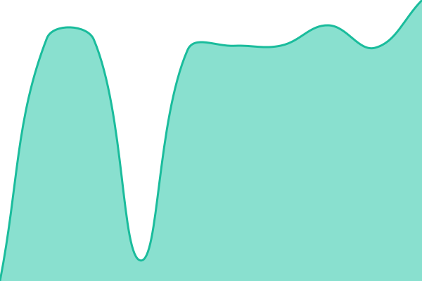 1514ms
     
 | 

<a href="https://myqua.github.io/LOUIS-upptime/history/la-tech-enterprise">97.30%</a>
    

|  [Loyola New Orleans Enterprise](https://loyno.ent.sirsi.net/client/en_US/loyola/search/results?te=) | 🟩 Up | [loyola-new-orleans-enterprise.yml](https://github.com/myqua/LOUIS-upptime/commits/HEAD/history/loyola-new-orleans-enterprise.yml) | 

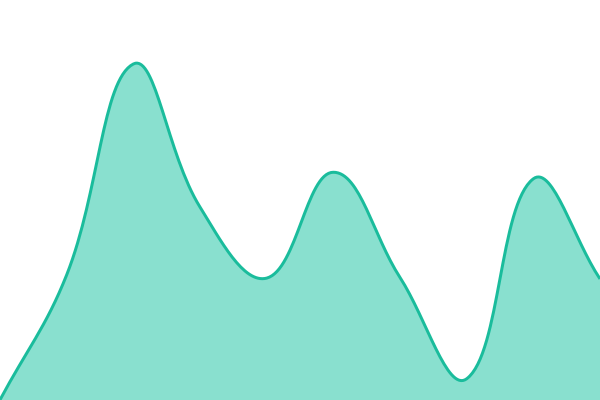 1053ms
     
 | 

<a href="https://myqua.github.io/LOUIS-upptime/history/loyola-new-orleans-enterprise">97.30%</a>
    

|  [LUMCON Enterprise](https://lumcon.ent.sirsi.net/client/en_US/lumcon/search/results?te=) | 🟩 Up | [lumcon-enterprise.yml](https://github.com/myqua/LOUIS-upptime/commits/HEAD/history/lumcon-enterprise.yml) | 

 910ms
     
 | 

<a href="https://myqua.github.io/LOUIS-upptime/history/lumcon-enterprise">97.30%</a>
    

|  [Nicholls Enterprise](https://nicholls.ent.sirsi.net/client/en_US/nicholls/search/results?te=) | 🟩 Up | [nicholls-enterprise.yml](https://github.com/myqua/LOUIS-upptime/commits/HEAD/history/nicholls-enterprise.yml) | 

 1723ms
     
 | 

<a href="https://myqua.github.io/LOUIS-upptime/history/nicholls-enterprise">97.31%</a>
    

|  [Northshore Enterprise](https://northshore.ent.sirsi.net/client/en_US/northshore/search/results?te=) | 🟩 Up | [northshore-enterprise.yml](https://github.com/myqua/LOUIS-upptime/commits/HEAD/history/northshore-enterprise.yml) | 

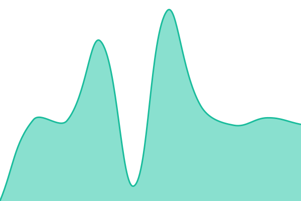 947ms
     
 | 

<a href="https://myqua.github.io/LOUIS-upptime/history/northshore-enterprise">97.31%</a>
    

|  [NSULA Enterprise](https://nsula.ent.sirsi.net/client/en_US/nsula/search/results?te=) | 🟩 Up | [nsula-enterprise.yml](https://github.com/myqua/LOUIS-upptime/commits/HEAD/history/nsula-enterprise.yml) | 

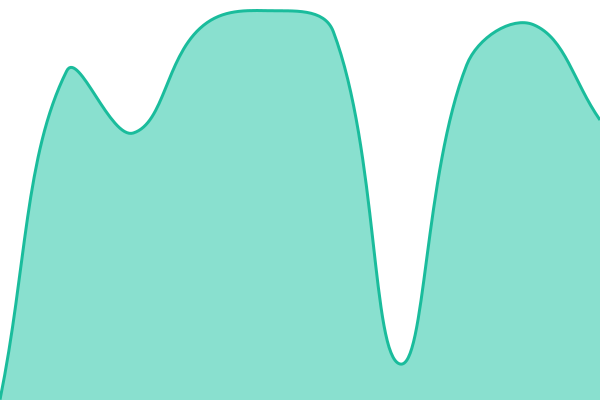 804ms
     
 | 

<a href="https://myqua.github.io/LOUIS-upptime/history/nsula-enterprise">97.31%</a>
    

|  [Nunez Enterprise](https://nunez.ent.sirsi.net/client/en_US/nunez/search/results?te=) | 🟩 Up | [nunez-enterprise.yml](https://github.com/myqua/LOUIS-upptime/commits/HEAD/history/nunez-enterprise.yml) | 

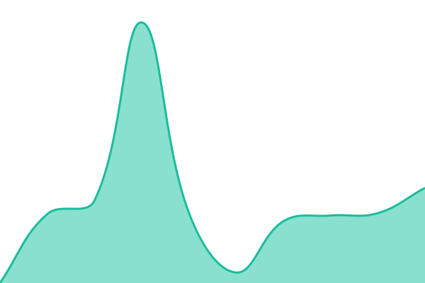 1344ms
     
 | 

<a href="https://myqua.github.io/LOUIS-upptime/history/nunez-enterprise">97.31%</a>
    

|  [FranU Enterprise](https://franu.ent.sirsi.net/client/en_US/franu/search/results?te=) | 🟩 Up | [fran-u-enterprise.yml](https://github.com/myqua/LOUIS-upptime/commits/HEAD/history/fran-u-enterprise.yml) | 

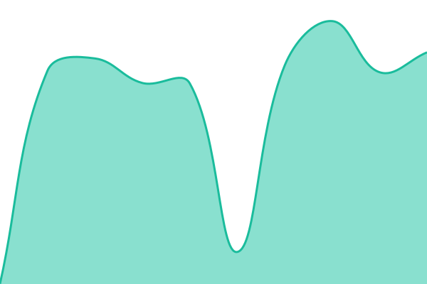 959ms
     
 | 

<a href="https://myqua.github.io/LOUIS-upptime/history/fran-u-enterprise">97.31%</a>
    

|  [RPCC Enterprise](https://rpcc.ent.sirsi.net/client/en_US/rpcc/search/results?te=) | 🟩 Up | [rpcc-enterprise.yml](https://github.com/myqua/LOUIS-upptime/commits/HEAD/history/rpcc-enterprise.yml) | 

 872ms
     
 | 

<a href="https://myqua.github.io/LOUIS-upptime/history/rpcc-enterprise">97.32%</a>
    

|  [SLCC Enterprise](https://slcc.ent.sirsi.net/client/en_US/slcc/search/results?te=) | 🟩 Up | [slcc-enterprise.yml](https://github.com/myqua/LOUIS-upptime/commits/HEAD/history/slcc-enterprise.yml) | 

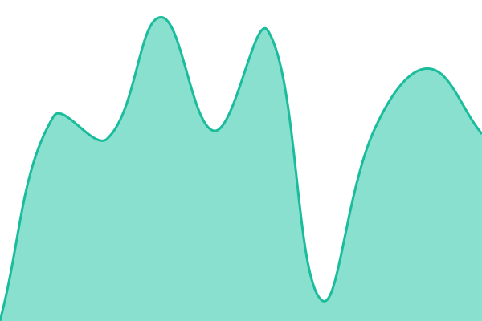 1215ms
     
 | 

<a href="https://myqua.github.io/LOUIS-upptime/history/slcc-enterprise">97.32%</a>
    

|  [UHCNO Enterprise](https://uhcno.ent.sirsi.net/client/en_US/uhcno/search/results?te=) | 🟩 Up | [uhcno-enterprise.yml](https://github.com/myqua/LOUIS-upptime/commits/HEAD/history/uhcno-enterprise.yml) | 

 1156ms
     
 | 

<a href="https://myqua.github.io/LOUIS-upptime/history/uhcno-enterprise">97.32%</a>
    

|  [CLTCC Enterprise](https://cltcc.ent.sirsi.net/client/en_US/cltcc/search/results?te=) | 🟩 Up | [cltcc-enterprise.yml](https://github.com/myqua/LOUIS-upptime/commits/HEAD/history/cltcc-enterprise.yml) | 

 805ms
     
 | 

<a href="https://myqua.github.io/LOUIS-upptime/history/cltcc-enterprise">97.32%</a>
    

|  [Delgado Enterprise](https://delgado.ent.sirsi.net/client/en_US/delgado/search/results?te=) | 🟩 Up | [delgado-enterprise.yml](https://github.com/myqua/LOUIS-upptime/commits/HEAD/history/delgado-enterprise.yml) | 

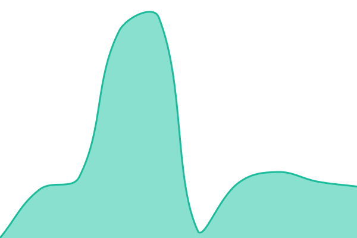 2163ms
     
 | 

<a href="https://myqua.github.io/LOUIS-upptime/history/delgado-enterprise">97.32%</a>
    

|  [Loyola Law Enterprise](https://loynolaw.ent.sirsi.net/client/en_US/loynolaw/search/results?te=) | 🟩 Up | [loyola-law-enterprise.yml](https://github.com/myqua/LOUIS-upptime/commits/HEAD/history/loyola-law-enterprise.yml) | 

 809ms
     
 | 

<a href="https://myqua.github.io/LOUIS-upptime/history/loyola-law-enterprise">97.32%</a>
    

|  [NOBTS Enterprise](https://nobts.ent.sirsi.net/client/en_US/nobts/search/results?te=) | 🟩 Up | [nobts-enterprise.yml](https://github.com/myqua/LOUIS-upptime/commits/HEAD/history/nobts-enterprise.yml) | 

 1198ms
     
 | 

<a href="https://myqua.github.io/LOUIS-upptime/history/nobts-enterprise">100.00%</a>
    

|  [SLU Enterprise](https://slu.ent.sirsi.net/client/en_US/slu/search/results?te=) | 🟩 Up | [slu-enterprise.yml](https://github.com/myqua/LOUIS-upptime/commits/HEAD/history/slu-enterprise.yml) | 

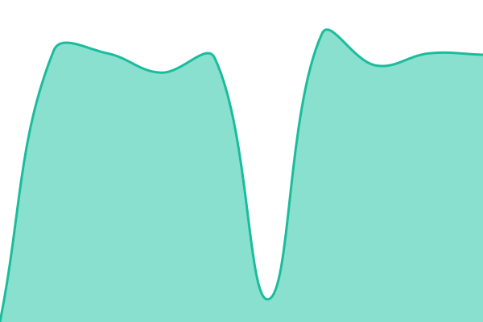 1191ms
     
 | 

<a href="https://myqua.github.io/LOUIS-upptime/history/slu-enterprise">97.33%</a>
    

|  [SOWELA Enterprise](https://sowela.ent.sirsi.net/client/en_US/sowela/search/results?te=) | 🟩 Up | [sowela-enterprise.yml](https://github.com/myqua/LOUIS-upptime/commits/HEAD/history/sowela-enterprise.yml) | 

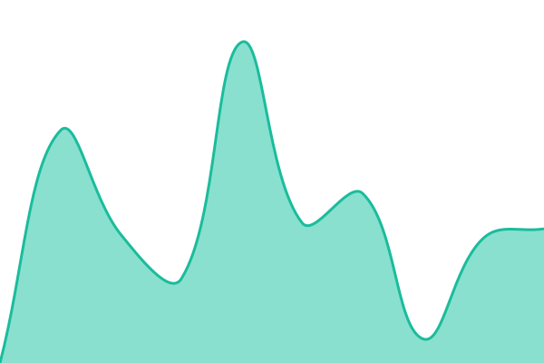 1323ms
     
 | 

<a href="https://myqua.github.io/LOUIS-upptime/history/sowela-enterprise">97.33%</a>
    

|  [SUBR Enterprise](https://subr.ent.sirsi.net/client/en_US/subr/search/results?te=) | 🟩 Up | [subr-enterprise.yml](https://github.com/myqua/LOUIS-upptime/commits/HEAD/history/subr-enterprise.yml) | 

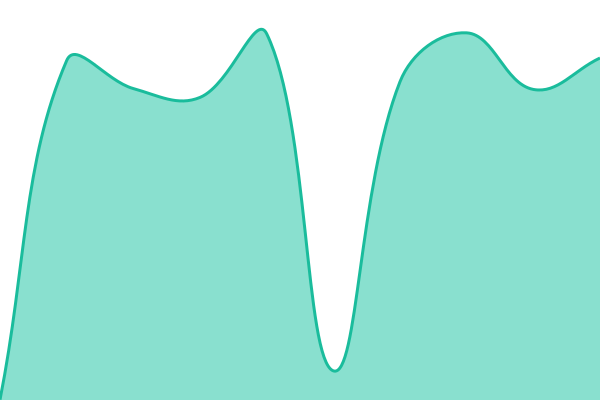 1052ms
     
 | 

<a href="https://myqua.github.io/LOUIS-upptime/history/subr-enterprise">97.33%</a>
    

|  [SULAW Enterprise](https://sulaw.ent.sirsi.net/client/en_US/sulaw/search/results?te=) | 🟩 Up | [sulaw-enterprise.yml](https://github.com/myqua/LOUIS-upptime/commits/HEAD/history/sulaw-enterprise.yml) | 

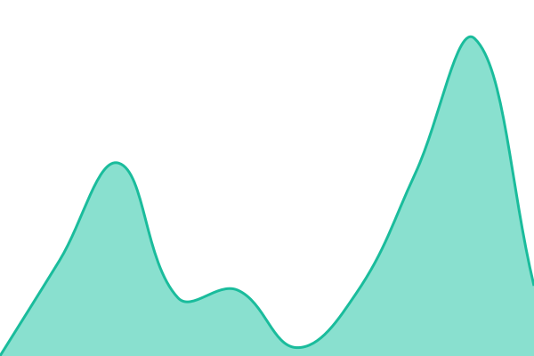 2689ms
     
 | 

<a href="https://myqua.github.io/LOUIS-upptime/history/sulaw-enterprise">97.33%</a>
    

|  [SUNO Enterprise](https://suno.ent.sirsi.net/client/en_US/suno/search/results?te=) | 🟩 Up | [suno-enterprise.yml](https://github.com/myqua/LOUIS-upptime/commits/HEAD/history/suno-enterprise.yml) | 

 3040ms
     
 | 

<a href="https://myqua.github.io/LOUIS-upptime/history/suno-enterprise">97.33%</a>
    

|  [SUSLA Enterprise](https://susla.ent.sirsi.net/client/en_US/susla/search/results?te=) | 🟩 Up | [susla-enterprise.yml](https://github.com/myqua/LOUIS-upptime/commits/HEAD/history/susla-enterprise.yml) | 

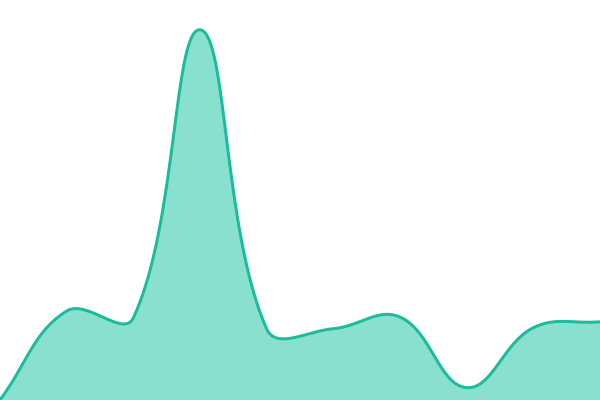 1000ms
     
 | 

<a href="https://myqua.github.io/LOUIS-upptime/history/susla-enterprise">97.33%</a>
    

|  [ULL Enterprise](https://ull.ent.sirsi.net/client/en_US/ull/search/results?te=) | 🟩 Up | [ull-enterprise.yml](https://github.com/myqua/LOUIS-upptime/commits/HEAD/history/ull-enterprise.yml) | 

 1848ms
     
 | 

<a href="https://myqua.github.io/LOUIS-upptime/history/ull-enterprise">97.34%</a>
    

|  [ULM Enterprise](https://ulm.ent.sirsi.net/client/en_US/ulm/search/results?te=) | 🟩 Up | [ulm-enterprise.yml](https://github.com/myqua/LOUIS-upptime/commits/HEAD/history/ulm-enterprise.yml) | 

 1485ms
     
 | 

<a href="https://myqua.github.io/LOUIS-upptime/history/ulm-enterprise">97.34%</a>
    

|  [UNO Enterprise](https://uno.ent.sirsi.net/client/en_US/uno/search/results?te=) | 🟩 Up | [uno-enterprise.yml](https://github.com/myqua/LOUIS-upptime/commits/HEAD/history/uno-enterprise.yml) | 

 1626ms
     
 | 

<a href="https://myqua.github.io/LOUIS-upptime/history/uno-enterprise">97.34%</a>
    

|  [KWYJIBO Test](https://lsuces.ent.sirsi.net/client/en_US/lsuces/search/results?qu=kwyjibo&te=SD_LSUCES) | 🟨 Degraded | [kwyjibo-test.yml](https://github.com/myqua/LOUIS-upptime/commits/HEAD/history/kwyjibo-test.yml) | 

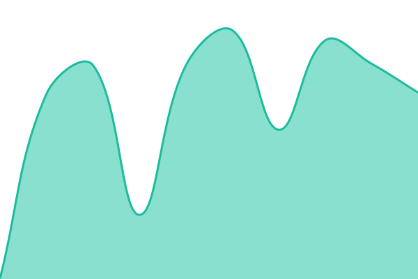 400ms
     
 | 

<a href="https://myqua.github.io/LOUIS-upptime/history/kwyjibo-test">0.00%</a>
    

<!--end: status pages-->

## 📄 License

- Powered by: [Upptime](https://github.com/upptime/upptime)
- Code: [MIT](./LICENSE) © [Upptime](https://upptime.js.org)
- Data in the `./history` directory: [Open Database License](https://opendatacommons.org/licenses/odbl/1-0/)
